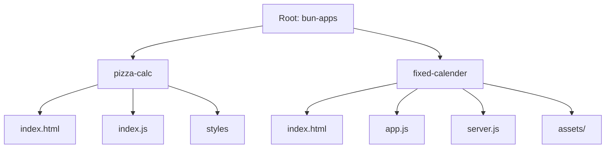

<div align="center">

# Bun Apps Monorepo

[](https://github.com/SahajJain01/bun-apps/actions/workflows/monorepo.yml)


Curated set of small web apps built with Bun. Simple to run, easy to extend, and wired up with CI for smooth deploys.

</div>

---

## Table of Contents

- Overview
- Monorepo Apps
- Quick Start
- Project Structure
- CI/CD
- Add A New App
- Screenshots & Visuals
- Links

## Overview

This repository hosts multiple micro‑apps under a single Bun‑powered workspace. Each app is self‑contained and can be run independently. The repository includes a GitHub Actions workflow that builds changed apps and triggers a deploy sync via a webhook.

## Monorepo Apps

Below are the apps currently included. Each entry links to its local README for details.

1) Fixed Calendar
   - Path: `apps/fixed-calender`
   - Tech:  
   - Run: `cd apps/fixed-calender && bun run start` then open `http://localhost:3000`
   - Config: `bun-app.json` sets `prod` and the configured domain `calendar.sahajjain.com`
   - Docs: [apps/fixed-calender/README.md](apps/fixed-calender/README.md)

2) Pizza Calculator
   - Path: `apps/pizza-calc`
   - Tech:  
   - Run: `bunx serve apps/pizza-calc -l 5173` (or open `apps/pizza-calc/index.html` directly)
   - Docs: [apps/pizza-calc/README.md](apps/pizza-calc/README.md)

## Quick Start

Prerequisites
- Bun (latest): https://bun.sh
- Git

Run an app
```bash
# Fixed Calendar (recommended)
cd apps/fixed-calender
bun run start
# open http://localhost:3000

# Pizza Calculator (static)
bunx serve apps/pizza-calc -l 5173
# open http://localhost:5173
```

## Project Structure

```text
bun-apps/
├─ apps/
│  ├─ fixed-calender/
│  │  ├─ index.html
│  │  ├─ app.js
│  │  ├─ server.js
│  │  ├─ bun-app.json
│  │  └─ assets/
│  └─ pizza-calc/
│     ├─ index.html
│     ├─ index.js
│     ├─ style.css
│     └─ package.json
├─ .github/workflows/monorepo.yml
└─ README.md
```

## CI/CD

Workflow: `.github/workflows/monorepo.yml` — [open in GitHub](https://github.com/SahajJain01/bun-apps/actions/workflows/monorepo.yml)

- What: Build changed apps and trigger a deploy sync webhook.
- Triggers: Pushes to `main` that touch `apps/**`, plus manual runs.
- Build: For each changed `apps/<name>`:
  - Runs `bun install` if `package.json` exists.
  - If `package.json` has a `build` script, runs `bun run build`.
- Deploy: On success, posts to the NixOS sync webhook once:
  - URL: `https://deploy.sahajjain.com/sync`
  - Header: `x-webhook-token: ${{ secrets.BUN_SYNC_TOKEN }}`
- Secret: Add repo secret `BUN_SYNC_TOKEN` to authorize the webhook.
- Manual: In Actions, run “Monorepo CI & Deploy”. Optional input lets you only test the webhook.

## Add A New App

1) Create a folder under `apps/<your-app>`.
2) Optional: add `package.json` with `start`/`build` scripts to integrate better with CI.
3) If you need prod metadata, add `bun-app.json` with keys like `name`, `prod`, `domain`.
4) Document usage in `apps/<your-app>/README.md`.

Tip: The CI only builds apps changed in a commit. Keeping each app self‑contained speeds builds.

## Screenshots & Visuals

Mermaid monorepo map (rendered on GitHub):



## Links

- Bun: https://bun.sh/docs
- GitHub Actions: https://docs.github.com/actions
- AngularJS (1.x): https://code.angularjs.org/1.6.2/docs/guide
- Bootstrap: https://getbootstrap.com/docs/4.5/getting-started/introduction/
- jQuery: https://jquery.com/


